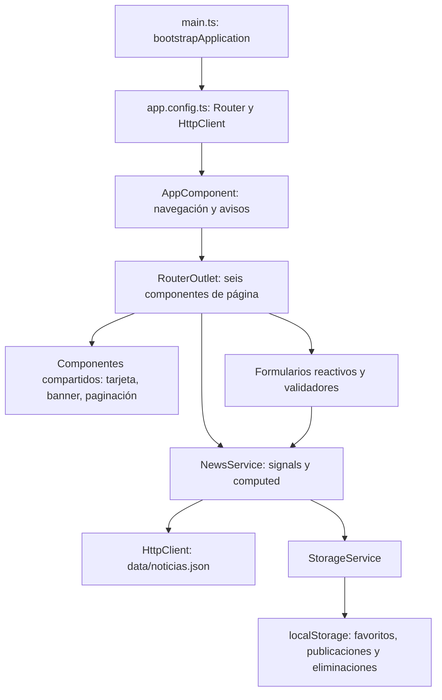

# Arquitectura de PoliTechNews en Angular

La presentación usa plantillas Angular y la hoja visual original. Los componentes de página gestionan filtros y formularios; NewsService reúne el estado compartido y valida los datos; StorageService adapta la persistencia del navegador. El enrutador carga cada página bajo demanda. La compilación genera archivos estáticos servidos por GitHub Pages.

El CRUD y los favoritos no sincronizan datos entre dispositivos. El formulario de contacto es una demostración de validación. No hay autenticación, API de escritura ni base de datos; esas capacidades no son exigidas por las orientaciones de esta entrega.
